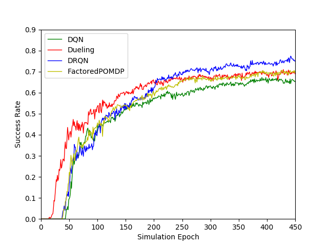

# Results of Benchmarks for EmotionalSimulator

<table>
  <tr><td rowspan="2"><b>Model Name</b></td><td colspan="2"><b>Epoch=150</b></td><td colspan="2"><b>Epoch=300</b></td><td colspan="2"><b>Epoch=450</b></td></tr>
  <tr><td>Suc.</td><td>Turn</td><td>Suc.</td><td>Turn</td><td>Suc.</td><td>Turn</td></tr>
<tr><td><b>DQN</b></td><td>0.42109</td><td>29.67</td><td>0.56996</td><td>25.41</td><td>0.62602</td><td>23.38</td></tr>
<tr><td><b>Dueling</b></td><td>0.51746</td><td>26.04</td><td>0.65145</td><td>21.58</td><td>0.66762</td><td>20.55</td></tr>
<tr><td><b>DRQN</b></td><td>0.4202</td><td>30.33</td><td>0.62668</td><td>24.37</td><td>0.70367</td><td>20.48</td></tr>
<tr><td><b>FactoredPOMDP</b></td><td>0.44523</td><td>28.77</td><td>0.5943</td><td>24.69</td><td>0.66176</td><td>22.02</td></tr>
 </table>

