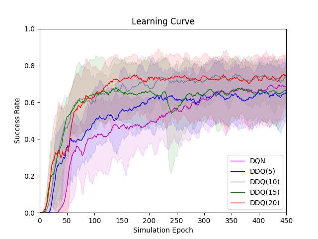
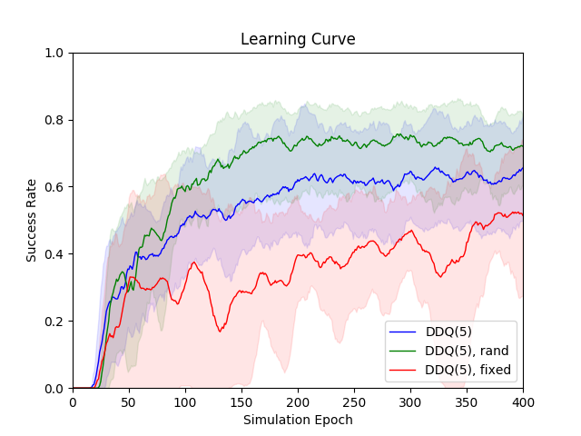
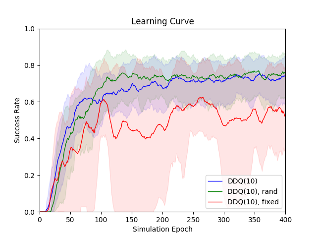
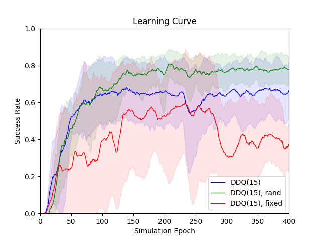
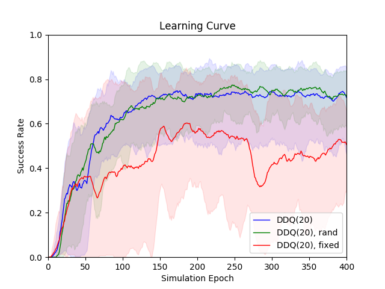

# Policy-Model-Comparison

#### DDQ(K)
  

Results of DDQ(K) model for K in [0, 5, 10, 15, 20], where DDQ(0) is same as a regular DQN.
<table>
  <tr><td rowspan="2"><b>Model Name</b></td><td colspan="3"><b>Epoch=100</b></td><td colspan="3"><b>Epoch=200</b></td><td colspan="3"><b>Epoch=300</b></td><td colspan="3"><b>Epoch=400</b></td></tr>
  <tr><td>Suc.</td><td>Rew.</td><td>Turn</td><td>Suc.</td><td>Rew.</td><td>Turn</td><td>Suc.</td><td>Rew.</td><td>Turn</td><td>Suc.</td><td>Rew.</td><td>Turn</td></tr>
<tr><td><b>DQN</b></td><td>0.4192</td><td>-3.97</td><td>30.54</td><td>0.4904</td><td>5.61</td><td>28.47</td><td>0.614</td><td>22.35</td><td>24.66</td><td>0.6692</td><td>29.78</td><td>23.05</td></tr>
<tr><td><b>DDQ(5)</b></td><td>0.4952</td><td>6.13</td><td>28.58</td><td>0.6208</td><td>23.49</td><td>24.01</td><td>0.646</td><td>27.45</td><td>22.14</td><td>0.6556</td><td>28.83</td><td>21.69</td></tr>
<tr><td><b>DDQ(10)</b></td><td>0.6</td><td>21.01</td><td>23.97</td><td>0.6776</td><td>31.73</td><td>21.17</td><td>0.7112</td><td>36.65</td><td>19.39</td><td>0.7372</td><td>39.88</td><td>19.16</td></tr>
<tr><td><b>DDQ(15)</b></td><td>0.638</td><td>26.55</td><td>22.02</td><td>0.658</td><td>29.24</td><td>21.45</td><td>0.6448</td><td>27.3</td><td>22.16</td><td>0.6644</td><td>30.2</td><td>21.05</td></tr>
<tr><td><b>DDQ(20)</b></td><td>0.63</td><td>25.37</td><td>22.47</td><td>0.7236</td><td>37.81</td><td>20.04</td><td>0.7432</td><td>40.41</td><td>19.56</td><td>0.718</td><td>37.02</td><td>20.27</td></tr>
 </table>

#### DDQ(K)-rand  

<table>
  <tr><td rowspan="2"><b>Model Name</b></td><td colspan="3"><b>Epoch=100</b></td><td colspan="3"><b>Epoch=200</b></td><td colspan="3"><b>Epoch=300</b></td><td colspan="3"><b>Epoch=400</b></td></tr>
  <tr><td>Suc.</td><td>Rew.</td><td>Turn</td><td>Suc.</td><td>Rew.</td><td>Turn</td><td>Suc.</td><td>Rew.</td><td>Turn</td><td>Suc.</td><td>Rew.</td><td>Turn</td></tr>
<tr><td><b>DQN</b></td><td>0.4192</td><td>-3.97</td><td>30.54</td><td>0.4904</td><td>5.61</td><td>28.47</td><td>0.614</td><td>22.35</td><td>24.66</td><td>0.6692</td><td>29.78</td><td>23.05</td></tr>
<tr><td><b>DDQ(5), rand</b></td><td>0.5852</td><td>19.17</td><td>24.1</td><td>0.7296</td><td>38.48</td><td>20.15</td><td>0.7536</td><td>41.62</td><td>19.62</td><td>0.72</td><td>37.76</td><td>19.27</td></tr>
<tr><td><b>DDQ(10), rand</b></td><td>0.6788</td><td>31.72</td><td>21.47</td><td>0.7452</td><td>40.77</td><td>19.31</td><td>0.7292</td><td>38.83</td><td>19.35</td><td>0.7532</td><td>42.05</td><td>18.67</td></tr>
<tr><td><b>DDQ(15), rand</b></td><td>0.6768</td><td>31.0</td><td>22.44</td><td>0.7512</td><td>41.51</td><td>19.26</td><td>0.7688</td><td>43.6</td><td>19.32</td><td>0.7792</td><td>45.03</td><td>18.95</td></tr>
<tr><td><b>DDQ(20), rand</b></td><td>0.6176</td><td>23.04</td><td>24.14</td><td>0.7264</td><td>38.27</td><td>19.8</td><td>0.75</td><td>40.94</td><td>20.13</td><td>0.7224</td><td>37.92</td><td>19.54</td></tr>
 </table>

#### DQN(K)
<table>
  <tr><td rowspan="2"><b>Model Name</b></td><td colspan="3"><b>Epoch=100</b></td><td colspan="3"><b>Epoch=200</b></td><td colspan="3"><b>Epoch=300</b></td><td colspan="3"><b>Epoch=400</b></td></tr>
  <tr><td>Suc.</td><td>Rew.</td><td>Turn</td><td>Suc.</td><td>Rew.</td><td>Turn</td><td>Suc.</td><td>Rew.</td><td>Turn</td><td>Suc.</td><td>Rew.</td><td>Turn</td></tr>
<tr><td><b>DQN(5)</b></td><td>0.808</td><td>50.5</td><td>14.92</td><td>0.8352</td><td>53.77</td><td>14.91</td><td>0.8128</td><td>51.19</td><td>14.69</td><td>0.798</td><td>48.98</td><td>15.55</td></tr>
<tr><td><b>DQN(10)</b></td><td>0.8024</td><td>50.28</td><td>14.01</td><td>0.792</td><td>49.03</td><td>14.02</td><td>0.8176</td><td>51.89</td><td>14.44</td><td>0.7972</td><td>49.55</td><td>14.23</td></tr>
<tr><td><b>DQN(15)</b></td><td>0.7932</td><td>49.0</td><td>14.38</td><td>0.7908</td><td>48.41</td><td>14.97</td><td>0.7864</td><td>47.48</td><td>15.78</td><td>0.8</td><td>48.79</td><td>16.41</td></tr>
<tr><td><b>DQN(20)</b></td><td>0.7972</td><td>50.12</td><td>13.08</td><td>0.7992</td><td>50.83</td><td>12.15</td><td>0.7892</td><td>49.48</td><td>12.45</td><td>0.798</td><td>50.41</td><td>12.7</td></tr>
 </table>

#### DDQ(5)  

<table>
  <tr><td rowspan="2"><b>Model Name</b></td><td colspan="3"><b>Epoch=100</b></td><td colspan="3"><b>Epoch=200</b></td><td colspan="3"><b>Epoch=300</b></td><td colspan="3"><b>Epoch=400</b></td></tr>
  <tr><td>Suc.</td><td>Rew.</td><td>Turn</td><td>Suc.</td><td>Rew.</td><td>Turn</td><td>Suc.</td><td>Rew.</td><td>Turn</td><td>Suc.</td><td>Rew.</td><td>Turn</td></tr>
<tr><td><b>DDQ(5)</b></td><td>0.4952</td><td>6.13</td><td>28.58</td><td>0.6208</td><td>23.49</td><td>24.01</td><td>0.646</td><td>27.45</td><td>22.14</td><td>0.6556</td><td>28.83</td><td>21.69</td></tr>
<tr><td><b>DDQ(5), rand</b></td><td>0.5852</td><td>19.17</td><td>24.1</td><td>0.7296</td><td>38.48</td><td>20.15</td><td>0.7536</td><td>41.62</td><td>19.62</td><td>0.72</td><td>37.76</td><td>19.27</td></tr>
<tr><td><b>DDQ(5), fixed</b></td><td>0.3096</td><td>-19.34</td><td>34.99</td><td>0.3964</td><td>-8.24</td><td>33.61</td><td>0.4648</td><td>1.36</td><td>30.83</td><td>0.514</td><td>8.11</td><td>29.15</td></tr>
 </table>

#### DDQ(10)  

<table>
  <tr><td rowspan="2"><b>Model Name</b></td><td colspan="3"><b>Epoch=100</b></td><td colspan="3"><b>Epoch=200</b></td><td colspan="3"><b>Epoch=300</b></td><td colspan="3"><b>Epoch=400</b></td></tr>
  <tr><td>Suc.</td><td>Rew.</td><td>Turn</td><td>Suc.</td><td>Rew.</td><td>Turn</td><td>Suc.</td><td>Rew.</td><td>Turn</td><td>Suc.</td><td>Rew.</td><td>Turn</td></tr>
<tr><td><b>DDQ(10)</b></td><td>0.6</td><td>21.01</td><td>23.97</td><td>0.6776</td><td>31.73</td><td>21.17</td><td>0.7112</td><td>36.65</td><td>19.39</td><td>0.7372</td><td>39.88</td><td>19.16</td></tr>
<tr><td><b>DDQ(10), rand</b></td><td>0.6788</td><td>31.72</td><td>21.47</td><td>0.7452</td><td>40.77</td><td>19.31</td><td>0.7292</td><td>38.83</td><td>19.35</td><td>0.7532</td><td>42.05</td><td>18.67</td></tr>
<tr><td><b>DDQ(10), fixed</b></td><td>0.5928</td><td>19.07</td><td>26.14</td><td>0.4644</td><td>1.81</td><td>29.84</td><td>0.4708</td><td>1.98</td><td>31.03</td><td>0.5156</td><td>7.28</td><td>31.18</td></tr>
 </table>
#### DDQ(15)  

<table>
  <tr><td rowspan="2"><b>Model Name</b></td><td colspan="3"><b>Epoch=100</b></td><td colspan="3"><b>Epoch=200</b></td><td colspan="3"><b>Epoch=300</b></td><td colspan="3"><b>Epoch=400</b></td></tr>
  <tr><td>Suc.</td><td>Rew.</td><td>Turn</td><td>Suc.</td><td>Rew.</td><td>Turn</td><td>Suc.</td><td>Rew.</td><td>Turn</td><td>Suc.</td><td>Rew.</td><td>Turn</td></tr>
<tr><td><b>DDQ(15)</b></td><td>0.638</td><td>26.55</td><td>22.02</td><td>0.658</td><td>29.24</td><td>21.45</td><td>0.6448</td><td>27.3</td><td>22.16</td><td>0.6644</td><td>30.2</td><td>21.05</td></tr>
<tr><td><b>DDQ(15), rand</b></td><td>0.6768</td><td>31.0</td><td>22.44</td><td>0.7512</td><td>41.51</td><td>19.26</td><td>0.7688</td><td>43.6</td><td>19.32</td><td>0.7792</td><td>45.03</td><td>18.95</td></tr>
<tr><td><b>DDQ(15), fixed</b></td><td>0.3952</td><td>-7.93</td><td>32.72</td><td>0.5256</td><td>10.33</td><td>27.49</td><td>0.3096</td><td>-18.99</td><td>34.29</td><td>0.3748</td><td>-9.95</td><td>31.86</td></tr>
 </table>

#### DDQ(20)  

<table>
  <tr><td rowspan="2"><b>Model Name</b></td><td colspan="3"><b>Epoch=100</b></td><td colspan="3"><b>Epoch=200</b></td><td colspan="3"><b>Epoch=300</b></td><td colspan="3"><b>Epoch=400</b></td></tr>
  <tr><td>Suc.</td><td>Rew.</td><td>Turn</td><td>Suc.</td><td>Rew.</td><td>Turn</td><td>Suc.</td><td>Rew.</td><td>Turn</td><td>Suc.</td><td>Rew.</td><td>Turn</td></tr>
<tr><td><b>DDQ(20)</b></td><td>0.63</td><td>25.37</td><td>22.47</td><td>0.7236</td><td>37.81</td><td>20.04</td><td>0.7432</td><td>40.41</td><td>19.56</td><td>0.718</td><td>37.02</td><td>20.27</td></tr>
<tr><td><b>DDQ(20), rand</b></td><td>0.6176</td><td>23.04</td><td>24.14</td><td>0.7264</td><td>38.27</td><td>19.8</td><td>0.75</td><td>40.94</td><td>20.13</td><td>0.7224</td><td>37.92</td><td>19.54</td></tr>
<tr><td><b>DDQ(20), fixed</b></td><td>0.4032</td><td>-6.5</td><td>31.78</td><td>0.564</td><td>14.71</td><td>27.95</td><td>0.416</td><td>-4.79</td><td>31.42</td><td>0.506</td><td>6.78</td><td>29.89</td></tr>
 </table>

