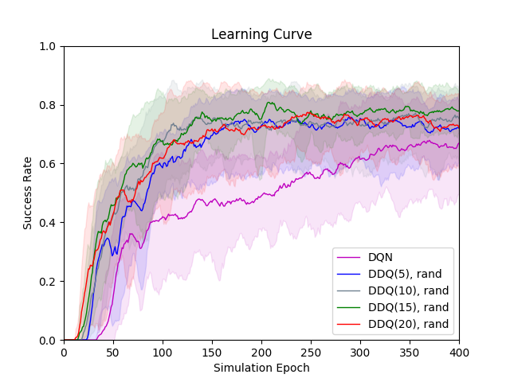

# Policy-Model-Comparison

#### DDQ(K)
  

Results of DDQ(K) model for K in [0, 5, 10, 15, 20], where DDQ(0) is same as a regular DQN.
<table>
  <tr><td rowspan="2"><b>Model Name</b></td><td colspan="3"><b>Epoch=100</b></td><td colspan="3"><b>Epoch=200</b></td><td colspan="3"><b>Epoch=300</b></td><td colspan="3"><b>Epoch=400</b></td></tr>
  <tr><td>Suc.</td><td>Rew.</td><td>Turn</td><td>Suc.</td><td>Rew.</td><td>Turn</td><td>Suc.</td><td>Rew.</td><td>Turn</td><td>Suc.</td><td>Rew.</td><td>Turn</td></tr>
<tr><td><b>DDQ(0)</b></td><td>0.4</td><td>-6.4</td><td>30.81</td><td>0.488</td><td>5.46</td><td>28.2</td><td>0.604</td><td>21.28</td><td>24.41</td><td>0.692</td><td>32.89</td><td>22.3</td></tr>
<tr><td><b>DDQ(5)</b></td><td>0.548</td><td>13.05</td><td>27.42</td><td>0.668</td><td>29.68</td><td>22.97</td><td>0.6</td><td>21.81</td><td>22.38</td><td>0.62</td><td>24.18</td><td>22.43</td></tr>
<tr><td><b>DDQ(10)</b></td><td>0.668</td><td>30.09</td><td>22.14</td><td>0.72</td><td>36.83</td><td>21.14</td><td>0.688</td><td>34.44</td><td>18.23</td><td>0.756</td><td>42.46</td><td>18.53</td></tr>
<tr><td><b>DDQ(15)</b></td><td>0.68</td><td>31.46</td><td>22.28</td><td>0.64</td><td>26.94</td><td>21.72</td><td>0.648</td><td>27.68</td><td>22.15</td><td>0.7</td><td>35.16</td><td>19.67</td></tr>
<tr><td><b>DDQ(20)</b></td><td>0.66</td><td>29.08</td><td>22.23</td><td>0.728</td><td>38.37</td><td>19.98</td><td>0.748</td><td>40.73</td><td>20.06</td><td>0.68</td><td>32.47</td><td>20.26</td></tr>
 </table>

#### DDQ(K)-rand  

<table>
  <tr><td rowspan="2"><b>Model Name</b></td><td colspan="3"><b>Epoch=100</b></td><td colspan="3"><b>Epoch=200</b></td><td colspan="3"><b>Epoch=300</b></td><td colspan="3"><b>Epoch=400</b></td></tr>
  <tr><td>Suc.</td><td>Rew.</td><td>Turn</td><td>Suc.</td><td>Rew.</td><td>Turn</td><td>Suc.</td><td>Rew.</td><td>Turn</td><td>Suc.</td><td>Rew.</td><td>Turn</td></tr>
<tr><td><b>DQN</b></td><td>0.4</td><td>-6.4</td><td>30.81</td><td>0.488</td><td>5.46</td><td>28.2</td><td>0.604</td><td>21.28</td><td>24.41</td><td>0.692</td><td>32.89</td><td>22.3</td></tr>
<tr><td><b>DDQ(5), rand</b></td><td>0.508</td><td>9.54</td><td>24.85</td><td>0.744</td><td>40.72</td><td>19.12</td><td>0.78</td><td>44.81</td><td>19.58</td><td>0.712</td><td>37.02</td><td>18.85</td></tr>
<tr><td><b>DDQ(10), rand</b></td><td>0.708</td><td>35.68</td><td>20.56</td><td>0.756</td><td>41.77</td><td>19.9</td><td>0.672</td><td>31.73</td><td>19.82</td><td>0.792</td><td>47.19</td><td>17.7</td></tr>
<tr><td><b>DDQ(15), rand</b></td><td>0.652</td><td>28.49</td><td>21.5</td><td>0.704</td><td>35.85</td><td>19.26</td><td>0.792</td><td>46.9</td><td>18.29</td><td>0.792</td><td>46.48</td><td>19.12</td></tr>
<tr><td><b>DDQ(20), rand</b></td><td>0.632</td><td>24.78</td><td>24.12</td><td>0.732</td><td>39.06</td><td>19.56</td><td>0.752</td><td>41.08</td><td>20.32</td><td>0.724</td><td>37.82</td><td>20.13</td></tr>
 </table>

#### DDQ(5)  

<table>
  <tr><td rowspan="2"><b>Model Name</b></td><td colspan="3"><b>Epoch=100</b></td><td colspan="3"><b>Epoch=200</b></td><td colspan="3"><b>Epoch=300</b></td><td colspan="3"><b>Epoch=400</b></td></tr>
  <tr><td>Suc.</td><td>Rew.</td><td>Turn</td><td>Suc.</td><td>Rew.</td><td>Turn</td><td>Suc.</td><td>Rew.</td><td>Turn</td><td>Suc.</td><td>Rew.</td><td>Turn</td></tr>
<tr><td><b>DDQ(5)</b></td><td>0.548</td><td>13.05</td><td>27.42</td><td>0.668</td><td>29.68</td><td>22.97</td><td>0.6</td><td>21.81</td><td>22.38</td><td>0.62</td><td>24.18</td><td>22.43</td></tr>
<tr><td><b>DDQ(5), rand</b></td><td>0.508</td><td>9.54</td><td>24.85</td><td>0.744</td><td>40.72</td><td>19.12</td><td>0.78</td><td>44.81</td><td>19.58</td><td>0.712</td><td>37.02</td><td>18.85</td></tr>
<tr><td><b>DDQ(5), fixed</b></td><td>0.284</td><td>-22.98</td><td>36.11</td><td>0.388</td><td>-9.49</td><td>34.1</td><td>0.472</td><td>2.14</td><td>30.99</td><td>0.536</td><td>10.58</td><td>29.48</td></tr>
 </table>

#### DDQ(10)  

<table>
  <tr><td rowspan="2"><b>Model Name</b></td><td colspan="3"><b>Epoch=100</b></td><td colspan="3"><b>Epoch=200</b></td><td colspan="3"><b>Epoch=300</b></td><td colspan="3"><b>Epoch=400</b></td></tr>
  <tr><td>Suc.</td><td>Rew.</td><td>Turn</td><td>Suc.</td><td>Rew.</td><td>Turn</td><td>Suc.</td><td>Rew.</td><td>Turn</td><td>Suc.</td><td>Rew.</td><td>Turn</td></tr>
<tr><td><b>DDQ(10)</b></td><td>0.668</td><td>30.09</td><td>22.14</td><td>0.72</td><td>36.83</td><td>21.14</td><td>0.688</td><td>34.44</td><td>18.23</td><td>0.756</td><td>42.46</td><td>18.53</td></tr>
<tr><td><b>DDQ(10), rand</b></td><td>0.708</td><td>35.68</td><td>20.56</td><td>0.756</td><td>41.77</td><td>19.9</td><td>0.672</td><td>31.73</td><td>19.82</td><td>0.792</td><td>47.19</td><td>17.7</td></tr>
<tr><td><b>DDQ(10), fixed</b></td><td>0.632</td><td>23.62</td><td>26.43</td><td>0.436</td><td>-1.62</td><td>29.87</td><td>0.432</td><td>-3.04</td><td>31.77</td><td>0.604</td><td>19.19</td><td>28.58</td></tr>
 </table>
#### DDQ(15)  

<table>
  <tr><td rowspan="2"><b>Model Name</b></td><td colspan="3"><b>Epoch=100</b></td><td colspan="3"><b>Epoch=200</b></td><td colspan="3"><b>Epoch=300</b></td><td colspan="3"><b>Epoch=400</b></td></tr>
  <tr><td>Suc.</td><td>Rew.</td><td>Turn</td><td>Suc.</td><td>Rew.</td><td>Turn</td><td>Suc.</td><td>Rew.</td><td>Turn</td><td>Suc.</td><td>Rew.</td><td>Turn</td></tr>
<tr><td><b>DDQ(15)</b></td><td>0.68</td><td>31.46</td><td>22.28</td><td>0.64</td><td>26.94</td><td>21.72</td><td>0.648</td><td>27.68</td><td>22.15</td><td>0.7</td><td>35.16</td><td>19.67</td></tr>
<tr><td><b>DDQ(15), rand</b></td><td>0.652</td><td>28.49</td><td>21.5</td><td>0.704</td><td>35.85</td><td>19.26</td><td>0.792</td><td>46.9</td><td>18.29</td><td>0.792</td><td>46.48</td><td>19.12</td></tr>
<tr><td><b>DDQ(15), fixed</b></td><td>0.464</td><td>0.98</td><td>31.39</td><td>0.58</td><td>16.99</td><td>27.22</td><td>0.284</td><td>-22.58</td><td>35.31</td><td>0.38</td><td>-9.8</td><td>32.8</td></tr>
 </table>

#### DDQ(20)  

<table>
  <tr><td rowspan="2"><b>Model Name</b></td><td colspan="3"><b>Epoch=100</b></td><td colspan="3"><b>Epoch=200</b></td><td colspan="3"><b>Epoch=300</b></td><td colspan="3"><b>Epoch=400</b></td></tr>
  <tr><td>Suc.</td><td>Rew.</td><td>Turn</td><td>Suc.</td><td>Rew.</td><td>Turn</td><td>Suc.</td><td>Rew.</td><td>Turn</td><td>Suc.</td><td>Rew.</td><td>Turn</td></tr>
<tr><td><b>DDQ(20)</b></td><td>0.66</td><td>29.08</td><td>22.23</td><td>0.728</td><td>38.37</td><td>19.98</td><td>0.748</td><td>40.73</td><td>20.06</td><td>0.68</td><td>32.47</td><td>20.26</td></tr>
<tr><td><b>DDQ(20), rand</b></td><td>0.632</td><td>24.78</td><td>24.12</td><td>0.732</td><td>39.06</td><td>19.56</td><td>0.752</td><td>41.08</td><td>20.32</td><td>0.724</td><td>37.82</td><td>20.13</td></tr>
<tr><td><b>DDQ(20), fixed</b></td><td>0.396</td><td>-7.29</td><td>31.62</td><td>0.556</td><td>13.44</td><td>28.57</td><td>0.432</td><td>-2.57</td><td>30.82</td><td>0.576</td><td>15.24</td><td>29.76</td></tr>
 </table>

